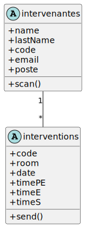
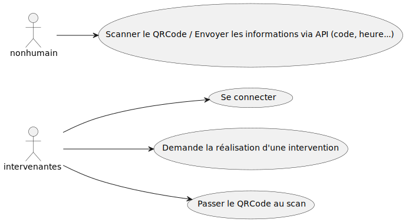

# Code-Alpha

### Modèles des collections MongoDB

```js
// modèle pour la collection `intervenantes`
const mongoose = require('mongoose');

const intervenantesSchema = mongoose.Schema({
	name: { type: String, required: true },
	lastName: { type: String, required: true },
	code: { type: Number, required: true },
	email: { type: String, required: true },
	poste: { type: String, required: true}
})

module.exports = mongoose.model('Intervenantes', intervenantesSchema)
```

```js
// modèle pour la collection `interventions`
const mongoose = require('mongoose');

const interventionsSchema = mongoose.Schema({
	code: { type: Number, required: true },
	room: { type: Number, required: true },
	date: { type: Number, required: true },
	timePE: { type: Number, required: true },
	timeE: { type: Number, required: true },
	timeS: { type: String, required: true }
	
})

module.exports = mongoose.model('interventions', interventionsScheme)
```

### Tableau URI (supportés par l'API)

| HTTP Verb | Path              | Action   | Description                             |
| --------- | ----------------- | -------- | --------------------------------------- |
| GET       | `/`               | index    | Accès à la page d'acceuil               |
| POST      | `/login`          | login    | Accès à la page de connexion            |
| POST      | `/createqr`       | createqr | Accès à la page de génération du QRCode |
| GET       | `/createsqr/scan` | createqr | Permet de la génération du QRCode       |

### Tableau des évènements redoutés

| Numéro de l'évènement | Evènement                                  | Impact pour l'entreprise                      | Gravité |
| --------------------- | ------------------------------------------ | --------------------------------------------- | ------- |
| 1                     | Une injection SQL donne un accès sans code | Problème de sécurité + Problème de confiance. | **      |
| 2                     | API saturée (DDOS)                         | Problème de sécurité                          | **      |
| 3                     | Le token n'est pas chiffré                 | Problème de sécurité                          | **      |

\* : Modéré /
** : Important

### Diagramme UML des entités



### Diagramme d'utilisation



### User story & Evil US

#### User Story

**En tant qu'intervenant, je veux avoir accès au service de la manière  la plus simple, afin d'être plus rapide dans l'exercice des interventions (réduction de temps).**

**Mesure :** En tant que **développeur**, afin **de prendre en compte le critère de réduction de temps, dans la procédure d'intervention (connection, génération du QRCode ...), je réalise un refonte du site web, afin de transformer celui-ci en progressive web app, qui permettra d'avoir un accès rapide au service, dans l'optique fixé.**

Exemple :

Je réalise une refonte du site web à l'aide du framework Angular et j'intègre la notion de PWA dans celle-ci, grâce à Angular PWA.

#### Evil US (1/2)

**En tant que personne malveillante, je veux avoir accès à la base de données afin d'exploiter les mots de passes et autres données ci-trouvant.**

**Contre-mesure :** En tant que **développeur**, afin **d'empêcher des personnes malveillantes qui souhaiteraient, à partir de la base de données, exploiter les mots de passes et autres informations ci-trouvant , je sécuriserais l'accès à la connexion de la base de données (dans la processus de connection)).**

Pour cela, je séparerais le code permettant de se connecter à la base de données et j'ajouterais à cela l'utilisation de variables d'environnements.

Exemple :

```js
// dans `/config/database.js`

const mongoose = require("mongoose");

const { mongoURI } = process.env;

exports.connect = () => {

	mongoose

		.connect(mongoURI, {

			useNewUrlParser: true,

			useUnifiedTopology: true,

		})

		.then(() => {

			console.log("Connexion à la base de donnée, réussite !");

		})

		.catch((error) => {

			console.log("La connexion a échouée !");

			console.error(error);

		});
};

```

```js
// dans `.env`

mongoURI=//URI MongoDB

```

#### Evil US (2/2)

**En tant que personne malveillante, je veux avoir accès aux informations contenues dans le QRCode (où les données sont actuellements en clair) afin d'exploiter les données ci-trouvant.**

**Contre-mesure :** En tant que **développeur**, afin **d'empêcher des personnes malveillantes qui souhaiteraient, à partir du QRCode, exploiter les données ci-trouvant , je sécuriserais les données communiqué au travers de celui-ci.**

Pour cela, deux solutions sont envisageables.
La première, rapide, serait de chiffrer uniquement le code de l'intervenant.
La deuxième, plus longue, serait de chriffrer l'ensemble des données et utiliser un système de token.

PS : Pour cette Evil US, l'option envisagée est la première.

Exemple :

```js
// dans `app.js` -> route `/register`

const bcrypt = require("bcryptjs");

[...]

bCryptPassword = bcrypt.hash(code, 10);

```